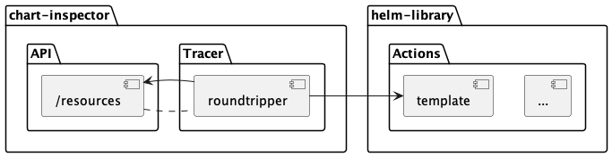

# Chart Inspector

Chart Inspector is a service that provides endpoints for inspecting Helm charts. It allows users to retrieve resources from Helm charts and perform various operations on them.

## Table of Contents

- [Overview](#overview)
- [Architecture](#architecture)
- [API](#api)

## Overview

Chart Inspector is a Krateo tool that enables the `composition-dynamic-controller` to generate its own RBAC policy. It returns a list of resources involved in a chart installation, considering the current cluster state using `helm template --server`, which evaluates lookups dynamically.

The `/resources` endpoint wraps the `http.RoundTripper` of the Helm client with a tracer that intercepts requests made to the Kubernetes API server. It then returns a list of resources involved in the chart installation.

## Architecture



## API

### API Endpoints

#### Retrieve Helm Chart Resources

- **Endpoint:** `/resources`
- **Method:** `GET`
- **Query Parameters:**
  - `compositionUID` (string): The unique identifier of the composition.
  - `compositionNamespace` (string): The namespace where the composition is located.
  - `compositionDefinitionUID` (string): The unique identifier of the composition definition.
  - `compositionDefinitionNamespace` (string): The namespace where the composition definition is located.
- **Response:** A JSON object containing the resources involved in the Helm chart template.

##### Example Request

```sh
curl "http://localhost:8081/resources?compositionUID=example-uid&compositionNamespace=default&compositionDefinitionUID=example-def-uid&compositionDefinitionNamespace=default"
```

### Swagger Documentation

Chart Inspector provides Swagger documentation for its API. You can access it at:

```
http://localhost:8081/swagger/
```

