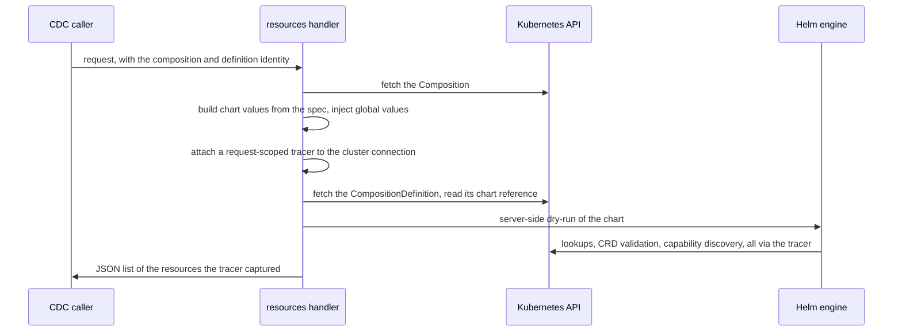

# API & request lifecycle

What the service exposes, what happens during a request, what the result means, and how the tracer produces it.

> The exact endpoint, parameters, and response shape are documented authoritatively by the generated Swagger, served at `/swagger/`. This page explains the behavior behind it.

## What it exposes

- **A liveness probe** and a **readiness probe** (readiness flips to "not ready" during shutdown).
- **The resources endpoint** — the one functional endpoint. It is given the identity of a `Composition` and of its `CompositionDefinition` (their names, namespaces, and GVRs), and returns the list of API resources the chart would touch.
- **The Swagger UI.**

## What happens during a request

If the chart references credentials, the handler fetches the password from the referenced `Secret` before the dry-run.

## What the result means

The response is a flat list of entries, each identifying one API resource the dry-run touched: its group, version, resource, namespace, and name. It is **not** a values schema, **not** RBAC rules, and **not** rendered YAML — the caller (the CDC) turns these entries into RBAC rules itself.

Two properties follow directly from *how* the list is produced (by observing traffic, see below), and any consumer must account for them:

- **It reflects what was *touched*, not what was *rendered*.** An object the dry-run never looks up can be missing; an object that is only looked up (a read-only dependency) is included.
- **Duplicates are normal.** The same object can appear several times, because the dry-run may look it up more than once. Consumers should de-duplicate.

## The tracer, conceptually

The list isn't built by parsing the chart's output. Instead, a small interceptor sits on the dry-run's connection to the API server and records every request, turning each one into a resource entry by reading the API path (which encodes the group, version, resource, namespace, and name). Because it records every matching call and never de-duplicates, repeated lookups become repeated entries — hence the duplicates above. This is also why the result is "what was touched": only resources that actually generate API traffic during the dry-run show up.
