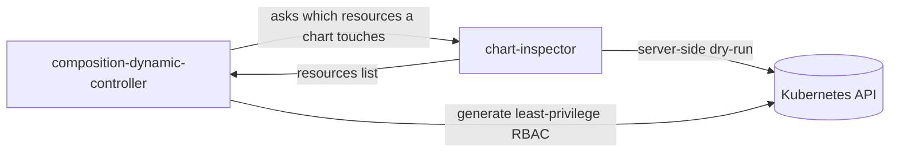

# chart-inspector — Developer Guide

A contributor-facing guide to the stateless HTTP service that tells the rest of Krateo **which Kubernetes resources a chart would touch**, by running a server-side Helm dry-run.

> Audience: engineers who **contribute to, extend, or debug `chart-inspector`** — not end users. This guide explains *ideas and flows*, not line-by-line code. For product concepts, see [docs.krateo.io](https://docs.krateo.io).

## Role in KCO

KCO turns Helm charts into Kubernetes-native APIs. **core-provider** generates a CRD from a chart's values schema and deploys, per `CompositionDefinition`, a **composition-dynamic-controller (CDC)**. The CDC renders the chart for each `Composition` instance and applies it as a Helm release. To scope its own **least-privilege RBAC**, the CDC needs to know exactly which API resources a chart manages — and that can only be answered by rendering the chart against the *live* cluster (Helm lookups and capability discovery are dynamic). `chart-inspector` answers that question: a single endpoint performs a **server-side Helm dry-run** and returns the set of API resources the chart touches.

Two things about this relationship are easy to misread:

- **The runtime caller is the CDC, not core-provider.** core-provider only injects the inspector's URL into the CDC's configuration; it never calls the service itself.
- **It is a separate service on purpose.** It holds a long-lived Helm client with a chart cache and a CRD watch that must live across requests, and server-side dry-runs need broad cluster read access — best isolated in its own pod and identity. See [`01-architecture.md`](./01-architecture.md).

## Documents in this folder

| Document | What it covers |
| --- | --- |
| [`01-architecture.md`](./01-architecture.md) | It's a thin HTTP service over the shared Helm engine: the main parts, how it boots, and the **tracer** idea (resources are discovered by *observing API traffic*, not by parsing rendered YAML). |
| [`02-api-and-request-lifecycle.md`](./02-api-and-request-lifecycle.md) | The endpoints, what happens during a request, what the result means, and how the tracer produces it. |
| [`03-extending.md`](./03-extending.md) | Adding an endpoint, extending the tracer, and changing the dry-run behavior. |

## See also

- **Ecosystem overview (canonical)** — the whole KCO pipeline lives in the **core-provider** repo: `core-provider/docs/developer-guide/00-ecosystem-overview.md`.
- **HTTP API (authoritative)** — the generated Swagger, served at `/swagger/`.
- **Logging contract** — `docs/logs-ingester-compatibility.md`.
- **Sibling guides** — **composition-dynamic-controller** (the caller) and **plumbing** (the Helm engine).
